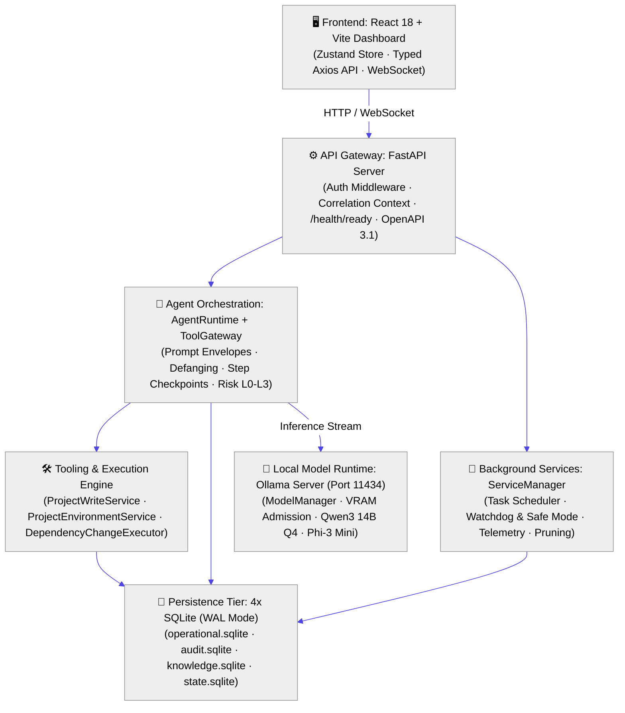
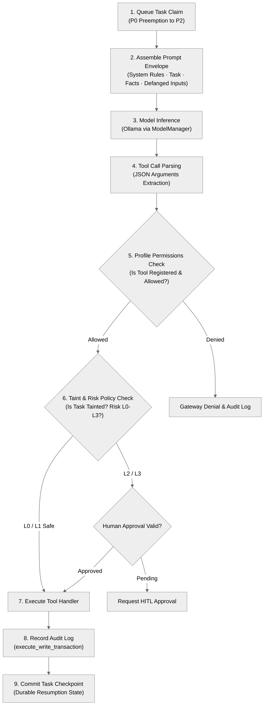
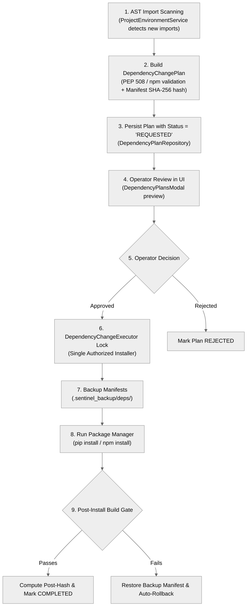
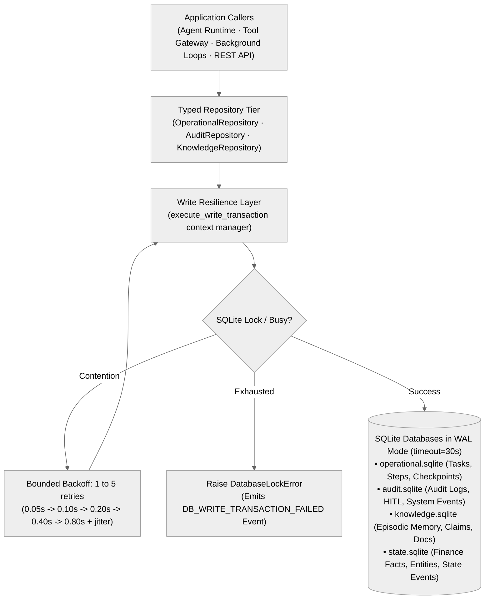

# CUA-Sentinel Architecture Blueprints (High-Legibility Edition)

This document provides modular, high-contrast, standard-font-size architecture diagrams for CUA-Sentinel.

---

## 1. Main System Architecture (Standard 16px Font)

---

## 2. Agent Execution & Tool Gateway Subsystem

---

## 3. Governed Dependency Change Pipeline

---

## 4. SQLite Multi-Database Persistence Tier

