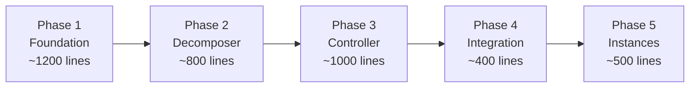

# v5 Progressive Assembly Pipeline — Implementation Plan

**Status:** COMPLETE — All 5 phases implemented and tested (28/28 tests passing)  
**Date:** 2025-01-XX  
**Blueprint Source:** [`docs/BLENDER_Pipeline_newBP.md`](file:///c:/Users/derik/Desktop/Derik/Projects/CUA-Sentinel/docs/BLENDER_Pipeline_newBP.md) (1736 lines, 45 sections)

---

## 1. What v4 Actually Is (Two Parallel Systems)

Before planning v5, it's critical to understand that v4 is actually **two separate pipeline systems** that coexist:

### System A: `backend/core/spec3d/` — Declarative Spec Pipeline (449+767+370+271+630+465+259 = ~3200 lines)

| File | Lines | Role |
|------|-------|------|
| [`schema.py`](file:///c:/Users/derik/Desktop/Derik/Projects/CUA-Sentinel/backend/core/spec3d/schema.py) | 213 | `QuadrupedSpec`, `HardSurfaceSpec`, `VesselSpec` Pydantic schemas |
| [`pipeline.py`](file:///c:/Users/derik/Desktop/Derik/Projects/CUA-Sentinel/backend/core/spec3d/pipeline.py) | 449 | `Spec3DPipeline.process_build_spec()` — routes, verify, compile, run |
| [`compiler.py`](file:///c:/Users/derik/Desktop/Derik/Projects/CUA-Sentinel/backend/core/spec3d/compiler.py) | 767 | Generates standalone `.py` scripts for `blender -b` |
| [`verifier.py`](file:///c:/Users/derik/Desktop/Derik/Projects/CUA-Sentinel/backend/core/spec3d/verifier.py) | 370 | Tier 1 (in-memory) + Tier 2 (mesh metrics) verification |
| [`runner.py`](file:///c:/Users/derik/Desktop/Derik/Projects/CUA-Sentinel/backend/core/spec3d/runner.py) | 271 | `HeadlessBlenderRunner` — subprocess `blender -b` |
| [`planner.py`](file:///c:/Users/derik/Desktop/Derik/Projects/CUA-Sentinel/backend/core/spec3d/planner.py) | 630 | LLM best-of-N planning, repair, scoring |
| [`templates.py`](file:///c:/Users/derik/Desktop/Derik/Projects/CUA-Sentinel/backend/core/spec3d/templates.py) | 465 | 9 golden archetype templates |
| [`library.py`](file:///c:/Users/derik/Desktop/Derik/Projects/CUA-Sentinel/backend/core/spec3d/library.py) | 259 | Filesystem-based approved spec store |

**Execution model:** `Prompt → (Library|LLM|Template) → Spec → Compile to .py → blender -b → .blend → MCP append`

### System B: `backend/core/blender_pipeline/` — Staged Assembly Pipeline (~3400+ lines)

| File | Lines | Role |
|------|-------|------|
| [`orchestrator.py`](file:///c:/Users/derik/Desktop/Derik/Projects/CUA-Sentinel/backend/core/blender_pipeline/orchestrator.py) | 401 | `StagedPipelineOrchestrator.run()` — Stages 0→4 |
| [`executor.py`](file:///c:/Users/derik/Desktop/Derik/Projects/CUA-Sentinel/backend/core/blender_pipeline/executor.py) | 1152 | Stages 4.5→6 — Blender execution + verification |
| [`stage0_understanding.py`](file:///c:/Users/derik/Desktop/Derik/Projects/CUA-Sentinel/backend/core/blender_pipeline/stage0_understanding.py) | ~250 | Category, scale, style tag |
| [`stage1_topology.py`](file:///c:/Users/derik/Desktop/Derik/Projects/CUA-Sentinel/backend/core/blender_pipeline/stage1_topology.py) | ~350 | Part tree (no numbers) |
| [`stage2_dimensions.py`](file:///c:/Users/derik/Desktop/Derik/Projects/CUA-Sentinel/backend/core/blender_pipeline/stage2_dimensions.py) | ~300 | Meters per part |
| [`stage3_semantics.py`](file:///c:/Users/derik/Desktop/Derik/Projects/CUA-Sentinel/backend/core/blender_pipeline/stage3_semantics.py) | ~250 | Attachment hints |
| [`stage4_resolver.py`](file:///c:/Users/derik/Desktop/Derik/Projects/CUA-Sentinel/backend/core/blender_pipeline/stage4_resolver.py) | 1489 | Pure-code transform resolution |
| [`stage45_modifiers.py`](file:///c:/Users/derik/Desktop/Derik/Projects/CUA-Sentinel/backend/core/blender_pipeline/stage45_modifiers.py) | ~150 | Bevel/subsurf intent |

**Execution model:** `Prompt → Stage 0 (LLM) → Stage 1 (LLM) → Stage 2 (LLM) → Stage 3 (LLM) → Stage 4 (code) → AssemblyGraph → graph_to_blender_steps() → MCP execute → Verify`

### Shared Infrastructure (used by both)

| File | Lines | Role |
|------|-------|------|
| [`assembly_spec.py`](file:///c:/Users/derik/Desktop/Derik/Projects/CUA-Sentinel/backend/core/assembly_spec.py) | 668 | `AssemblyGraph`, `AssemblyNode`, `graph_to_blender_steps()` |
| [`assembly_resolver.py`](file:///c:/Users/derik/Desktop/Derik/Projects/CUA-Sentinel/backend/core/assembly_resolver.py) | 306 | Top-down transform resolution + Blender execution |
| [`assembly_verification.py`](file:///c:/Users/derik/Desktop/Derik/Projects/CUA-Sentinel/backend/core/assembly_verification.py) | 493 | BVH/spatial verification gate |
| [`assembly_feedback.py`](file:///c:/Users/derik/Desktop/Derik/Projects/CUA-Sentinel/backend/core/assembly_feedback.py) | 148 | Deterministic mutation + diagnostic prompts |
| [`scene_transaction.py`](file:///c:/Users/derik/Desktop/Derik/Projects/CUA-Sentinel/backend/core/scene_transaction.py) | 212 | Generation-scoped atomic rollback |
| [`blender_ops.py`](file:///c:/Users/derik/Desktop/Derik/Projects/CUA-Sentinel/backend/core/blender_ops.py) | 1624 | 22 Pydantic models + Blender script templates |

---

## 2. What v5 Changes (Gap Analysis: Blueprint vs Current Code)

### Already implemented in v4 ✅

| Blueprint Requirement | v4 Status | Location |
|----------------------|-----------|----------|
| Core Invariant: no LLM raw numbers | ✅ Enforced | `stage4_resolver.py` — pure code |
| Stage 0 Object Understanding | ✅ | `stage0_understanding.py` |
| Stage 1–3 LLM stages | ✅ | `stage1_topology.py`, `stage2_dimensions.py`, `stage3_semantics.py` |
| Stage 4 Deterministic Resolution | ✅ (1489 lines) | `stage4_resolver.py` |
| Stage 4.5 Modifiers | ✅ | `stage45_modifiers.py` |
| Blender execution via MCP | ✅ | `executor.py` + `blender_ops.py` |
| Generation-scoped collections | ✅ | `scene_transaction.py` |
| Transactional rollback | ✅ | `scene_transaction.py` |
| No `clear_scene` | ✅ | Enforced throughout |
| BVH spatial verification | ✅ | `assembly_verification.py` |
| Euler rotation composition via matrices | ✅ | `assembly_spec.py` + `assembly_resolver.py` |
| Socket type vocabulary (17 types) | ✅ | `stage4_resolver.py` |
| Retry with stage-targeted feedback | ✅ (bounded) | `orchestrator.py` `_run_with_retry()` |
| Boolean difference support | ✅ | `JoinMode.BOOLEAN_DIFFERENCE` |
| WebSocket trace broadcast | ✅ | `broadcast.py` |

### New in v5 — Must Build 🔨

| Blueprint Requirement | Sections | Complexity | What Exists to Build On |
|----------------------|----------|------------|------------------------|
| **Containment Hierarchy** (variable-depth tree) | §2.1, §3, §4 | HIGH | `AssemblyNode.children` exists but flat in practice |
| **Dependency DAG** (separate from hierarchy) | §2.2, §34 | MEDIUM | None — currently implicit in parent order |
| **Relationship Graph** (cross-assembly sockets) | §2.3, §35 | MEDIUM | None — currently all sockets are parent-child |
| **Recursive Decomposer** (smart stop conditions) | §4, §5 | HIGH | None — currently single-pass LLM topology |
| **Persistent Build Manifest** (JSON checkpoint) | §6, §7, §19 | MEDIUM | `_pending_builds` in pipeline.py (minimal) |
| **Node State Machine** (10 states) | §8 | LOW | `AssemblyNode.status` exists (5 states) |
| **Build Frontier** | §9 | MEDIUM | None — currently sequential |
| **Smart Scheduler** | §10 | MEDIUM | None |
| **Bottom-Up Progressive Assembly** | §11, §31 | HIGH | Currently top-down in one pass |
| **Assembly Merge Operation** | §12 | HIGH | `JoinMode.FUSE` exists but no merge-then-verify loop |
| **Assembly Contract (interfaces/sockets)** | §13 | MEDIUM | `AttachmentSpec` exists but lacks public interface concept |
| **Instance Definitions** (definition vs placement) | §14 | MEDIUM | None — currently each copy is independent |
| **Surgical Failure Handling** (local → assembly → skip) | §15 | MEDIUM | `AssemblyFeedbackEngine` exists (partial) |
| **Required vs Optional components** | §16, §17 | LOW | None |
| **Degraded Completion** (SUCCESS_DEGRADED) | §17 | LOW | None — currently binary pass/fail |
| **Cleanup Before Retry** | §18 | LOW | `scene_transaction.py` rollback exists |
| **Checkpointing** (at verification boundaries) | §19 | MEDIUM | None |
| **Dirty Propagation** (STALE cascade) | §20 | MEDIUM | None |
| **Progressive Verification** (per-level) | §21 | MEDIUM | `AssemblyVerificationGate` exists (single-level) |
| **Retry Routing** (failure → specific stage) | §30 | LOW | `orchestrator.run_from_stage()` exists |

---

## 3. Open Design Decisions

> [!IMPORTANT]
> These 6 questions need YOUR input before implementation begins. Each has a recommended default.

### Q1: Persistence Location
**Options:**
- **(Recommended) JSON files** in `data/builds/{model_id}/manifest.json` — human-readable, git-friendly, matches existing `data/specs/` pattern
- SQLite in `operational.sqlite` — already used for `_pending_builds`, but harder to inspect/debug

### Q2: Checkpoint Granularity
**Options:**
- **(Recommended) Every verified node + every successful merge** — matches blueprint §19 exactly
- Only at assembly boundaries — faster but less crash-resilient

### Q3: Instance Implementation
**Options:**
- **(Recommended) Full mesh copies** initially, with Blender `linked duplicates` as a Phase 3+ optimization — simpler, more debuggable
- Linked duplicates from day 1 — more memory efficient but harder to verify individually

### Q4: Decomposition LLM Call Placement
**Options:**
- **(Recommended) New Stage 0.5** between Understanding and Topology — clean separation, dedicated prompt
- Extend Stage 0 output — faster (one LLM call) but overloads a single prompt

### Q5: Parallel Building
**Options:**
- **(Recommended) Single-threaded first** — v5 Phase 1 builds one node at a time; data structures support concurrency but don't require it
- Design for concurrency from day 1 — much more complex transaction/rollback logic

### Q6: Migration Path
**Options:**
- **(Recommended) Keep v4 (System B) as fallback** behind a feature flag; v5 is a new class `ProgressiveAssemblyController` that can be selected per-request
- Full replacement — risky, breaks existing 96 tests before v5 is proven

---

## 4. Phased Implementation Plan

### Phase 1: Foundation (State + Hierarchy) — ~1200 new lines

**Goal:** Build the data structures and manifest system. Nothing executes differently yet.

```
backend/core/blender_pipeline/
├── progressive/                    ← NEW subdirectory
│   ├── __init__.py
│   ├── manifest.py                 ← BuildManifest, NodeState, ModelManifest
│   ├── hierarchy.py                ← ContainmentTree, node CRUD, variable-depth
│   ├── dependency_graph.py         ← DependencyDAG, topological sort, cycle detection
│   └── node_types.py               ← NodeKind(PART|ASSEMBLY|INSTANCE|RELATIONSHIP)
```

#### New Files:

**`manifest.py`** (~300 lines)
```python
class NodeState(str, Enum):
    PLANNED = "planned"
    DECOMPOSING = "decomposing"
    READY = "ready"
    BUILDING = "building"
    VERIFYING = "verifying"
    VERIFIED = "verified"
    MERGING = "merging"
    FAILED = "failed"
    RETRYING = "retrying"
    SKIPPED = "skipped"
    STALE = "stale"

class NodeImportance(str, Enum):
    REQUIRED = "required"
    OPTIONAL = "optional"
    DECORATIVE = "decorative"

class CompletionStatus(str, Enum):
    SUCCESS = "success"
    COMPLETED_DEGRADED = "completed_degraded"
    FAILED = "failed"
    IN_PROGRESS = "in_progress"

@dataclass
class ManifestNode:
    node_id: str
    label: str
    kind: NodeKind                    # PART | ASSEMBLY | INSTANCE
    state: NodeState = NodeState.PLANNED
    importance: NodeImportance = NodeImportance.REQUIRED
    parent_id: Optional[str] = None
    children_ids: List[str] = field(default_factory=list)
    dependency_ids: List[str] = field(default_factory=list)
    instance_of: Optional[str] = None  # definition node_id for instances
    retry_count: int = 0
    max_retries: int = 3
    hierarchy_depth: int = 0
    stage_outputs: Dict[str, Any] = field(default_factory=dict)
    verification_result: Optional[Dict] = None
    error_message: Optional[str] = None
    blender_objects: List[str] = field(default_factory=list)  # generation-scoped names
    generation_id: Optional[str] = None

class BuildManifest:
    """Persistent build state — the v5 'working memory'."""
    model_id: str
    description: str
    root_node_id: str
    nodes: Dict[str, ManifestNode]
    created_at: str
    checkpoints: List[Dict]          # snapshot history
    completion_status: CompletionStatus

    def save(self, path: Path) -> None: ...
    @classmethod
    def load(cls, path: Path) -> "BuildManifest": ...
    def checkpoint(self) -> None: ...
    def get_node(self, node_id: str) -> ManifestNode: ...
    def transition(self, node_id: str, new_state: NodeState) -> None: ...
```

**`hierarchy.py`** (~200 lines)
```python
class ContainmentTree:
    """Variable-depth containment hierarchy with safety limits."""
    MAX_HIERARCHY_DEPTH = 6
    MAX_CHILDREN_PER_NODE = 12
    MAX_TOTAL_NODES = 100
    MAX_DECOMPOSITION_ATTEMPTS = 3

    def add_child(self, parent_id, child_node) -> None: ...
    def remove_subtree(self, node_id) -> List[str]: ...   # returns removed IDs
    def get_leaves(self) -> List[ManifestNode]: ...
    def get_ancestors(self, node_id) -> List[str]: ...
    def validate(self) -> List[str]: ...                    # returns errors
```

**`dependency_graph.py`** (~200 lines)
```python
class DependencyDAG:
    """Directed acyclic graph for build ordering."""
    def add_dependency(self, node_id, depends_on_id) -> None: ...
    def topological_sort(self) -> List[str]: ...
    def detect_cycles(self) -> List[List[str]]: ...
    def get_ready_nodes(self, completed: Set[str]) -> List[str]: ...
    def get_blocked_by(self, node_id) -> List[str]: ...     # what blocks this node
```

**Tests:** ~15 unit tests for manifest CRUD, hierarchy validation, DAG cycle detection, topological sort, checkpoint save/load.

**Connects to existing code:** Uses `NodeKind` ← extends `PartParadigm`. `ManifestNode` wraps `AssemblyNode` fields but adds state machine and persistence.

---

### Phase 2: Decomposer + Frontier + Scheduler — ~800 new lines

**Goal:** The LLM can recursively decompose a prompt into a hierarchy, and the scheduler picks build order.

```
backend/core/blender_pipeline/progressive/
├── decomposer.py                   ← RecursiveDecomposer (Stage 0.5)
├── frontier.py                     ← BuildFrontier
└── scheduler.py                    ← SmartScheduler
```

**`decomposer.py`** (~400 lines)
```python
class RecursiveDecomposer:
    """Stage 0.5: Converts model understanding into variable-depth hierarchy.

    Uses existing Stage 1 (topology) as the leaf-level decomposition,
    but adds recursive splitting with smart stop conditions.
    """
    async def decompose(
        self,
        prompt: str,
        stage0: ObjectUnderstanding,
        manifest: BuildManifest,
        model_manager: Any,
    ) -> None:
        """Mutates manifest in-place, adding hierarchy."""
        ...

    def _should_decompose(self, node: ManifestNode) -> bool:
        """Blueprint §4.2 stop conditions: geometric manageability,
        semantic cohesion, independent verifiability, interface clarity,
        complexity budget."""
        ...

    async def _decompose_node(self, node: ManifestNode, ...) -> List[ManifestNode]:
        """Single LLM call to split one node into children.
        Re-uses Stage1Topology prompt patterns."""
        ...
```

**Key design:** The decomposer calls the LLM once per non-leaf node. It re-uses `Stage1Topology._build_system_prompt()` patterns but scoped to a single node's context rather than the whole model. Stop conditions are evaluated by **code** (not LLM), matching blueprint §4.2 A–F.

**`frontier.py`** (~150 lines)
```python
class BuildFrontier:
    """Maintains the set of currently-actionable nodes.
    Blueprint §9: node enters frontier only when READY + deps VERIFIED + parent valid."""

    def refresh(self, manifest: BuildManifest, dag: DependencyDAG) -> List[str]:
        """Recompute frontier from current state."""
        ...

    def pop_next(self, scheduler: SmartScheduler) -> Optional[str]:
        """Pick and remove the highest-priority frontier node."""
        ...
```

**`scheduler.py`** (~250 lines)
```python
class SmartScheduler:
    """Blueprint §10: Picks best READY node considering dependency readiness,
    structural importance, blocking count, previous failures, and assembly progress.

    Scoring function:
        score = (blocks_others * 3) + (is_foundation * 2) + (is_definition * 2)
              - (retry_count * 1) - (estimated_complexity * 0.5)
    """
    def score_node(self, node_id: str, manifest: BuildManifest, dag: DependencyDAG) -> float: ...
    def pick_best(self, frontier: List[str], manifest: BuildManifest, dag: DependencyDAG) -> str: ...
```

**Tests:** ~12 tests — decomposer stop conditions, frontier refresh logic, scheduler priority ordering, instance detection.

---

### Phase 3: Progressive Controller + Merge — ~1000 new lines

**Goal:** The main progressive build loop. This is the core of v5.

```
backend/core/blender_pipeline/progressive/
├── controller.py                   ← ProgressiveAssemblyController (main loop)
├── merger.py                       ← AssemblyMerger (combine verified children)
├── checkpoint.py                   ← CheckpointManager (save/restore)
└── dirty_propagation.py            ← DirtyPropagator (STALE cascade)
```

**`controller.py`** (~500 lines) — The Heart of v5
```python
class ProgressiveAssemblyController:
    """Blueprint §31: Main progressive assembly loop.

    run_progressive_assembly(prompt) replaces run_staged_pipeline(prompt).

    Internally re-uses existing Stage 0–6 logic per-node.
    """
    async def run(self, prompt: str, model_manager: Any, mcp_manager: Any,
                  task_id: str) -> ProgressiveResult:
        # Stage 0: Object Understanding (unchanged)
        stage0 = await Stage0Understanding.run(...)

        # Stage 0.5: Recursive Decomposition (NEW)
        manifest = BuildManifest.create(model_id, prompt)
        await RecursiveDecomposer().decompose(prompt, stage0, manifest, model_manager)

        # Build DAG and initial frontier
        dag = DependencyDAG.from_manifest(manifest)
        frontier = BuildFrontier()
        scheduler = SmartScheduler()

        # ═══ PROGRESSIVE LOOP ═══
        while not manifest.is_root_resolved():
            node_id = frontier.pop_next(scheduler)
            if node_id is None:
                break  # deadlock or all done

            node = manifest.get_node(node_id)

            # Per-node pipeline: Stages 1–6 scoped to THIS node
            success = await self._build_node(node, manifest, stage0, ...)

            if success:
                manifest.transition(node_id, NodeState.VERIFIED)
                checkpoint_mgr.checkpoint(manifest)

                # Can parent merge?
                if self._can_merge_parent(node, manifest):
                    await merger.merge(node.parent_id, manifest, ...)
            else:
                await self._handle_failure(node, manifest, ...)

            frontier.refresh(manifest, dag)

        # Final model verification
        ...
        return ProgressiveResult(...)

    async def _build_node(self, node, manifest, stage0, ...):
        """Run stages 1→6 for a single node.
        Re-uses existing Stage classes, scoped to node context."""
        # Stage 1: Topology (for this node's children if ASSEMBLY)
        # Stage 2: Dimensions (for this node)
        # Stage 3: Semantics (for this node)
        # Stage 4: Resolver (for this node — uses parent geometry as context)
        # Stage 4.5: Modifiers
        # Stage 5: Blender execution (own generation scope)
        # Stage 6: Verification
        ...
```

> [!IMPORTANT]
> The key insight: **existing Stage 1–6 classes are re-used inside the loop**, not duplicated. Each stage just receives a narrower context (one node + parent geometry) instead of the whole model.

**`merger.py`** (~200 lines)
```python
class AssemblyMerger:
    """Blueprint §12: Merge verified children into parent assembly.
    Build → Verify → Lock → Merge → Verify → Lock."""

    async def merge(self, parent_id: str, manifest: BuildManifest,
                    mcp_manager: Any) -> bool:
        """Combine all VERIFIED children of parent into a single assembly.
        Uses existing JoinMode logic from assembly_spec.py."""
        ...

    async def _verify_merge(self, parent_id: str, manifest: BuildManifest,
                           mcp_manager: Any) -> bool:
        """Assembly-level verification after merge.
        Uses existing AssemblyVerificationGate."""
        ...
```

**`checkpoint.py`** (~100 lines)
```python
class CheckpointManager:
    """Blueprint §19: Saves manifest state at verification boundaries."""
    def checkpoint(self, manifest: BuildManifest) -> None: ...
    def restore_latest(self, model_id: str) -> Optional[BuildManifest]: ...
    def list_checkpoints(self, model_id: str) -> List[Dict]: ...
```

**`dirty_propagation.py`** (~100 lines)
```python
class DirtyPropagator:
    """Blueprint §20: When a node changes, mark dependents STALE."""
    def propagate(self, changed_node_id: str, manifest: BuildManifest,
                  dag: DependencyDAG) -> List[str]: ...  # returns newly-stale IDs
```

**Tests:** ~20 tests — progressive loop with mock LLM, merge verification, checkpoint save/restore, dirty propagation, degraded completion, failure handling.

---

### Phase 4: Integration + Feature Flag — ~400 new lines of glue

**Goal:** Wire v5 into the agent and API. Keep v4 as fallback.

**Changes to existing files:**

1. **[`endpoint_agent.py`](file:///c:/Users/derik/Desktop/Derik/Projects/CUA-Sentinel/backend/agents/endpoint_agent.py)** — Add `blender:build_progressive` tool alongside existing `blender:build_spec`
2. **[`executor.py`](file:///c:/Users/derik/Desktop/Derik/Projects/CUA-Sentinel/backend/core/blender_pipeline/executor.py)** — Add `run_node_pipeline()` method (node-scoped variant of `run_staged_pipeline_and_execute()`)
3. **[`assembly_spec.py`](file:///c:/Users/derik/Desktop/Derik/Projects/CUA-Sentinel/backend/core/assembly_spec.py)** — Add `AssemblyContract` class for public interface declaration
4. **Config:** Add `pipeline_version: "v4" | "v5"` to `mcp_apps.yaml` or `system_config.json`

```python
# In endpoint_agent.py — tool registration
{
    "name": "blender:build_progressive",
    "description": "Build a complex 3D model using progressive hierarchical assembly (v5)",
    "params": {"description": "str — natural language object description"},
}
```

**Feature flag logic:**
```python
if config.get("pipeline_version", "v4") == "v5":
    result = await ProgressiveAssemblyController().run(...)
else:
    result = await StagedPipelineOrchestrator.run(...)
```

---

### Phase 5: Instance Support + Cross-Assembly — ~500 new lines

**Goal:** Blueprint §14 (instances) and §35 (cross-assembly connections).

```
backend/core/blender_pipeline/progressive/
├── instances.py                    ← InstanceManager (definition vs placement)
└── relationships.py                ← RelationshipGraph (cross-assembly sockets)
```

**`instances.py`** (~250 lines)
- Build definition once, create N instances via mesh copy (Phase 1) or linked duplicate (later)
- Instance nodes have `instance_of` pointing to definition `node_id`
- Definition is built and verified once; instances only need placement verification

**`relationships.py`** (~250 lines)
- Cross-assembly socket connections (e.g., mast ↔ railing rigging)
- Socket positions resolved after both assemblies are VERIFIED
- Connector geometry computed deterministically from anchor world positions

---

## 5. File Structure Summary

```
backend/core/blender_pipeline/
├── orchestrator.py                 ← KEEP (v4 entry point, now wraps v5 too)
├── executor.py                     ← EXTEND (add run_node_pipeline)
├── stage0_understanding.py         ← KEEP (reused in v5)
├── stage1_topology.py              ← KEEP (reused per-node in v5)
├── stage2_dimensions.py            ← KEEP (reused per-node in v5)
├── stage3_semantics.py             ← KEEP (reused per-node in v5)
├── stage4_resolver.py              ← KEEP (reused per-node in v5)
├── stage45_modifiers.py            ← KEEP (reused per-node in v5)
├── broadcast.py                    ← KEEP (extended with node-level events)
├── primitive_readback.py           ← KEEP
│
└── progressive/                    ← ALL NEW
    ├── __init__.py
    ├── controller.py               ← Main loop (§31)
    ├── manifest.py                 ← BuildManifest + NodeState (§6, §8)
    ├── hierarchy.py                ← ContainmentTree (§2.1, §3)
    ├── dependency_graph.py         ← DependencyDAG (§2.2)
    ├── decomposer.py               ← RecursiveDecomposer (§4, §5)
    ├── frontier.py                 ← BuildFrontier (§9)
    ├── scheduler.py                ← SmartScheduler (§10)
    ├── merger.py                   ← AssemblyMerger (§12)
    ├── checkpoint.py               ← CheckpointManager (§19)
    ├── dirty_propagation.py        ← DirtyPropagator (§20)
    ├── instances.py                ← InstanceManager (§14) — Phase 5
    └── relationships.py            ← RelationshipGraph (§35) — Phase 5
```

**New lines:** ~3900 across 12 new files  
**Modified lines:** ~400 across 3 existing files  
**Deleted lines:** 0 (v4 preserved as fallback)

---

## 6. What Gets Reused vs Written Fresh

| Component | Reuse | New |
|-----------|-------|-----|
| Stage 0 Understanding | 100% reuse | — |
| Stage 1 Topology | ~80% reuse (prompt patterns) | Node-scoped wrapper |
| Stage 2 Dimensions | ~80% reuse | Node-scoped wrapper |
| Stage 3 Semantics | ~80% reuse | Node-scoped wrapper |
| Stage 4 Resolver | 100% reuse (1489 lines!) | — |
| Stage 4.5 Modifiers | 100% reuse | — |
| `graph_to_blender_steps()` | 100% reuse (668 lines) | — |
| `AssemblyVerificationGate` | 100% reuse (493 lines) | Hierarchy-level extension |
| `SceneTransaction` | 100% reuse (212 lines) | — |
| `AssemblyFeedbackEngine` | ~70% reuse | Extend for SKIP/DEGRADED |
| `blender_ops.py` | 100% reuse (1624 lines) | — |
| `broadcast.py` | ~90% reuse | Add node-level events |

**Reuse ratio: ~6500 lines reused / ~3900 new = 62% reuse**

---

## 7. Test Strategy

| Phase | New Tests | What They Cover |
|-------|-----------|-----------------|
| Phase 1 | 15 | Manifest CRUD, hierarchy validation, DAG cycle detection, checkpoint I/O |
| Phase 2 | 12 | Decomposer stop conditions, frontier logic, scheduler priority |
| Phase 3 | 20 | Progressive loop (mock LLM), merge verification, dirty propagation, degraded completion |
| Phase 4 | 8 | Feature flag routing, integration with endpoint_agent |
| Phase 5 | 10 | Instance placement, cross-assembly sockets |
| **Total** | **65** | Added to existing 96 → **161 total** |

---

## 8. Risk Assessment

| Risk | Mitigation |
|------|------------|
| Recursive decomposition produces too many nodes | Hard limits (§4.3): MAX_TOTAL_NODES=100, MAX_DEPTH=6 |
| LLM produces inconsistent hierarchies across calls | Code validates structure; LLM only provides semantics |
| Checkpoint file corruption on crash | JSON with atomic write (write to .tmp, rename) |
| Merge verification catches false positives | Reuse existing BVH tolerance thresholds (2mm gap, 0.5mm overlap) |
| v5 slower than v4 for simple objects | Decomposer evaluates complexity first; simple objects stay as single leaf → same speed as v4 |
| Breaking existing tests | v4 preserved behind feature flag; existing test suite unchanged |

---

## 9. Recommended Implementation Order



**Estimated effort per phase:**
- Phase 1: 1 session (data structures only, no LLM calls needed)
- Phase 2: 1–2 sessions (LLM integration for decomposer)
- Phase 3: 2–3 sessions (most complex — the progressive loop)
- Phase 4: 1 session (wiring + feature flag)
- Phase 5: 1–2 sessions (can be deferred)

---

## 10. Definition of Done (from Blueprint §44, mapped to phases)

| # | Requirement | Phase |
|---|-------------|-------|
| 1 | Accept complex model request | Phase 3 |
| 2 | Hierarchical model plan | Phase 2 |
| 3 | Recursive decomposition only where necessary | Phase 2 |
| 4 | Different depths for different branches | Phase 1+2 |
| 5 | Persist complete build state | Phase 1 |
| 6 | Dependency-aware build frontier | Phase 2 |
| 7 | Build one node at a time | Phase 3 |
| 8 | Verify each node | Phase 3 |
| 9 | Remove faulty geometry | Phase 3 (reuse SceneTransaction) |
| 10 | Retry only affected node | Phase 3 |
| 11 | Skip optional components | Phase 3 |
| 12 | Block parents on required failure | Phase 3 |
| 13 | Merge verified children | Phase 3 |
| 14 | Verify every merge | Phase 3 |
| 15 | Instance definitions vs placements | Phase 5 |
| 16 | Cross-assembly socket relationships | Phase 5 |
| 17 | Checkpoint successful progress | Phase 3 |
| 18 | Resume after interruption | Phase 3 |
| 19 | Propagate changes to dependents only | Phase 3 |
| 20 | Final verified root model | Phase 3 |
| 21 | Delete temporary state after success | Phase 3 |
| 22 | Preserve all v4 safety guarantees | All phases |
