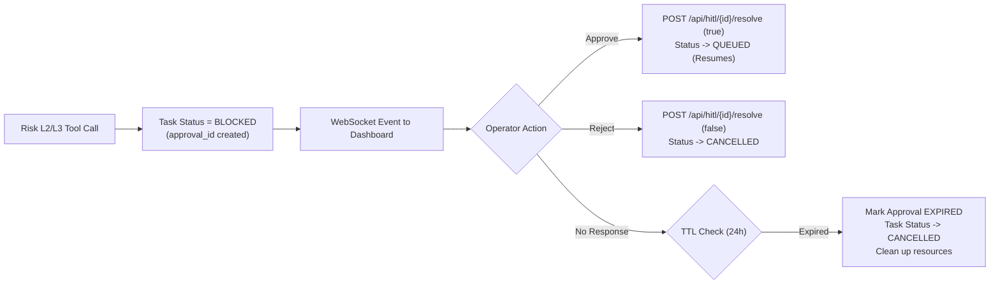

# Architectural Design Review Notes & Responses

This document captures the safety-first architecture review, design decisions, and failure-mode invariants for CUA-Sentinel.

---

## 1. System Scope & Topology Target

**Target Topology**: **Single-node, local-first Windows workstation** (NVIDIA RTX 3060 12GB VRAM).
- CUA-Sentinel is purpose-built as a self-contained personal AI command center, not a multi-tenant or distributed cloud cluster.
- Strict design requirements: 1-click launch (`launch.bat`), zero cloud telemetry, no required Docker/Kubernetes/Celery/Redis infrastructure, and total privacy for local files and personal finance/email data.

---

## 2. Cross-Database Atomicity & Crash Invariants

### Problem:
Four SQLite databases (`operational.sqlite`, `audit.sqlite`, `knowledge.sqlite`, `state.sqlite`) operate independently in WAL mode without cross-database distributed two-phase commits. If the process crashes between Step 8 (Audit Log) and Step 9 (Checkpoint Commit), state could diverge.

### Architectural Invariant & Source of Truth:
1. **Resumption Authority**: `operational.sqlite` (`task_checkpoints` table) is the **sole authoritative source of truth for task execution resumption**. When the scheduler recovers after an abnormal termination, it inspects the latest checkpoint matching the input SHA-256 hash.
2. **Audit Forensics**: The audit write in `audit.sqlite` precedes the checkpoint commit deliberately. In the event of a power outage or crash between the two writes:
   - The executed tool action is permanently recorded for human and security forensics.
   - The task resumes from the prior checkpoint.
   - `audit_logs.reconciliation_status` tracks alignment (`VALIDATED`, `PENDING`, `ORPHANED`). An audit entry without a corresponding completed step checkpoint is flagged as `ORPHANED` during recovery reconciliation.
   - For side-effecting actions, idempotency keys ensure tools with external side effects check prior execution before re-executing.

---

## 3. Contention, Bounded Retries & Upstream Backpressure

### Problem:
Under sustained concurrent database writes, exponential backoff (0.05s → 0.80s) could produce synchronized lock contention without an upstream circuit breaker.

### Upstream Backpressure & Circuit Breakers:
1. **Cooperative Preemption**: Long-running background loops check `runtime.should_yield(task_id)` between steps, yielding CPU and database locks when high-priority tasks (P0 chat) arrive.
2. **Watchdog Circuit Breaker**: The `Watchdog` service monitors consecutive database failures. If `DatabaseLockError` count exceeds threshold within a rolling 60-second window:
   - The watchdog trips the circuit breaker and enters **Safe Mode** with a 600-second cooldown.
   - Safe mode immediately halts all L2/L3 execution and background ingestion loops, allowing only read-only (L0) operations.
   - Write contention drops to near-zero, enabling the SQLite write-ahead log to checkpoint and recover cleanly.

---

## 4. Single Ollama Instance & Inference Contention

### Problem:
Only one LLM fits in 12GB VRAM (e.g. Qwen3 14B Q4 takes ~9GB). Simultaneous requests from user chat, background research, and sanitization contend for a single model engine.

### Scheduling Hierarchy:
1. **Priority Queue Admission**: Task priorities are strictly hierarchical:
   - **P0**: Interactive User Chat & Emergency Operations (immediate dispatch).
   - **P1**: Code Refactoring, Project Scaffolding, HITL-resumed tasks.
   - **P2**: Scheduled Research, RSS Digest Synthesis, Evaluation runs.
2. **Hot-Swap Admission Controller**: `ModelManager` serializes model loading and inference requests. If an interactive P0 chat message arrives while a P2 background digest is running, the P2 step completes its active generation, yields, and allows P0 immediate inference admission.
3. **No Unsupervised Model Switching**: Background loops cannot evict an active user model without queue priority preemption.

---

## 5. Orchestration-to-Storage Path Integrity

### Problem:
Orchestration writes directly to `operational.sqlite` (checkpoints, task state). We must guarantee this path does not become a backdoor bypassing taint and audit governance.

### Safeguards:
1. **Repository Mediation**: Direct SQL execution in agents is prohibited (verified by AST tests). Orchestration persists exclusively via `OperationalRepository`.
2. **Envelope Defanging**: Before prompts reach the model, `AgentRuntime.defang_text()` neutralizes spoofed section headers (`[SYSTEM RULES]`, `[TASK]`, `[FACTS]`, `[UNTRUSTED DATA]`).
3. **Taint Tracking**: If any tool absorbs untrusted external data (web pages, RSS feeds, email), `tasks.is_tainted` is persisted to disk. Even if the task restarts from a checkpoint, the taint flag remains set, prohibiting subsequent write tools without review.

---

## 6. HITL Pending Lifecycle & Eventual Consistency

### Problem:
If a task enters `BLOCKED` awaiting human approval (Risk L2/L3) and the operator never responds, what prevents task queue deadlock?

### Lifecycle & Expiration Protocol:

1. **Non-Blocking Queue**: When a task blocks on HITL, the scheduler immediately yields the worker thread to process other queued tasks.
2. **Durable Approval Nonces**: Each approval request generates a cryptographic nonce and strict expiration timestamp (`expires_at`, default 24h).
3. **Automatic Expiration**: The background janitor checks pending approvals; any request exceeding TTL is marked `EXPIRED`, moving the blocked task to `CANCELLED` with reason `"HITL approval expired without operator decision"`.
